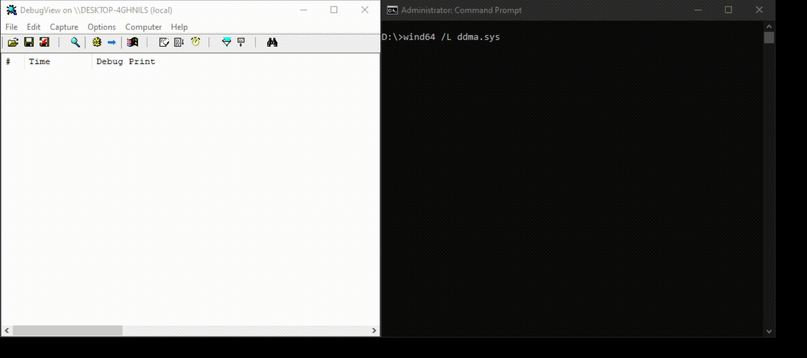

# ddma

A small proof-of-concept for using disk devices for DMA on Windows.

## Why

Some native hypervisors (i.e. Hyper-V) allow the guest unvirtualized device access, which means SLAT can be circumvented.

## Demo

Modifying Hyper-V at runtime (baremetal - 2004).

## Notes

If kernel debugging is enabled, then the demo will bugcheck due to `MiShowBadMapper`. You can fix this by changing the first byte the function references to `2`.

Your HBA may not support 64-bit addressing and thus cannot access higher physical memory.

This PoC also only supports ATA.